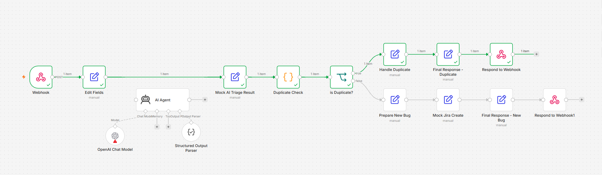

# 🤖 AI QA Bug Triage Automation

An AI-powered QA bug triage and duplicate detection workflow built with **n8n**.

This project demonstrates how QA workflows can be automated using webhooks, structured bug analysis, duplicate detection, conditional routing, and Jira integration concepts.

---

## 📌 Overview

The workflow accepts a bug report through an n8n webhook and processes it through a QA triage pipeline.

The current MVP:

- Receives bug reports through a webhook
- Normalizes the incoming bug data
- Performs structured QA triage
- Checks whether the bug already exists
- Routes duplicate and new bugs differently
- Prepares Jira-ready bug information
- Simulates Jira ticket creation
- Returns a structured JSON response

The project is designed to evolve toward **AI-powered defect triage and automated test-failure analysis**.

---

## 🏗️ Workflow Architecture



### Current Flow

```text
Postman / Bug Report
        ↓
   n8n Webhook
        ↓
    Edit Fields
        ↓
Mock AI Triage Result
        ↓
 Duplicate Check
        ↓
   Is Duplicate?
      ↙       ↘
    YES        NO
     ↓          ↓
Handle       Prepare
Duplicate    New Bug
     ↓          ↓
Final        Mock Jira
Response      Creation
                ↓
          Final Response
```

---

## 🚀 Current MVP Features

### 1. Webhook-Based Bug Ingestion

The workflow exposes a POST webhook that accepts structured bug reports.

Example input:

```json
{
  "title": "Login button not working",
  "description": "User enters valid username and password, but clicking the Login button does nothing.",
  "steps": [
    "Open the login page",
    "Enter valid username",
    "Enter valid password",
    "Click Login"
  ],
  "expected": "User should be redirected to the dashboard.",
  "actual": "Nothing happens after clicking Login.",
  "environment": "Chrome 153 on Windows 11"
}
```

---

### 2. Bug Data Normalization

The incoming webhook payload is transformed into a consistent internal structure containing:

- Bug title
- Description
- Steps to reproduce
- Expected result
- Actual result
- Environment

This provides a clean input for downstream QA processing.

---

### 3. Structured QA Triage

The workflow is designed to classify bugs using structured fields such as:

- Category
- Severity
- Priority
- Component
- Summary
- Investigation readiness

The current MVP uses a **Mock AI Triage Result** to simulate the AI output without requiring an external LLM API during development.

---

### 4. Duplicate Bug Detection

The workflow checks the incoming bug against existing simulated bugs.

The current MVP uses:

```text
Bug Title + Component
```

to identify an exact duplicate.

If a matching bug is found:

```text
DUPLICATE
```

the workflow prevents creation of a new Jira ticket.

---

### 5. Conditional Routing

The workflow uses an IF condition to route the bug:

```text
Duplicate
    ↓
No new Jira ticket

New Bug
    ↓
Prepare Jira information
    ↓
Create Jira ticket
```

---

### 6. Jira Integration Concept

For the current MVP, Jira creation is simulated.

A mock Jira response generates information such as:

```json
{
  "jiraKey": "QA-1001",
  "status": "CREATED",
  "project": "QA"
}
```

The next phase will replace this mock node with a real Jira API integration.

---

## 🧪 Example Results

### Duplicate Bug

```json
{
  "result": "DUPLICATE",
  "jiraKey": "DUPLICATE_NOT_CREATED",
  "severity": "High",
  "priority": "High",
  "summary": "Login button does not respond after valid credentials",
  "message": "Duplicate bug detected. No new Jira ticket created."
}
```

### New Bug

```json
{
  "result": "NEW_BUG_CREATED",
  "jiraKey": "QA-1001",
  "severity": "High",
  "priority": "High",
  "summary": "Login button does not respond after valid credentials",
  "message": "Bug created successfully"
}
```

---

## 🛠️ Technology Stack

- **n8n** – Workflow automation
- **AI / LLM** – Planned AI-powered triage
- **Webhooks** – Bug ingestion
- **Postman** – API testing
- **Jira** – Planned defect management integration
- **JSON** – Structured data exchange
- **QA Automation** – Defect triage and automation concepts

---

## 📂 Project Structure

```text
ai-qa-bug-triage-n8n/
│
├── README.md
│
├── workflow/
│   └── ai-qa-bug-triage-v1-mvp.json
│
├── screenshots/
│   └── workflow.png
│
└── docs/
```

---

## 🔄 Current Status

**Version:** V1 MVP

The workflow is currently a working proof of concept.

The main execution path currently uses:

- Mock AI triage
- Simulated duplicate data
- Mock Jira ticket creation

The n8n workflow also contains the configured **AI Agent**, OpenAI Chat Model, and structured output parser for the next development phase.

---

## 🔮 Future Enhancements

### Phase 2 – Real AI Triage

- Connect a real LLM
- Replace the mock triage node
- Generate dynamic severity and priority
- Generate concise defect summaries
- Assess investigation readiness

### Phase 3 – Real Jira Integration

- Create actual Jira defects
- Map severity and priority
- Add labels/components
- Attach reproduction information
- Return the real Jira issue key

### Phase 4 – Intelligent Duplicate Detection

Replace exact matching with semantic similarity.

```text
New Bug
   ↓
AI Embedding
   ↓
Search Historical Bugs
   ↓
Similarity Analysis
   ↓
Potential Duplicate?
```

### Phase 5 – Playwright Test Failure Integration

Extend the workflow beyond manually reported bugs.

```text
Playwright Test
       ↓
Test Failure
       ↓
Screenshot
       ↓
Stack Trace
       ↓
URL / Browser
       ↓
n8n
       ↓
AI Analysis
       ↓
Root Cause Analysis
       ↓
Jira Bug
```

### Phase 6 – QA AI Agent

The long-term goal is to evolve the workflow into an AI-assisted QA automation system capable of:

- Bug triage
- Duplicate detection
- Test failure analysis
- Root-cause analysis
- Automated defect creation
- Historical bug analysis
- QA notifications
- Test-result analysis

---

## 🎯 Project Goal

The goal of this project is to explore how **AI + workflow automation + QA automation** can be combined to reduce repetitive QA activities and improve the defect management lifecycle.

This project is being developed incrementally, starting with a working n8n MVP and progressively adding real AI, Jira, and automated test-failure integrations.
